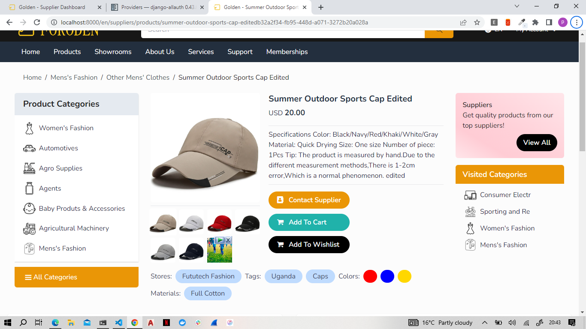

# B2B E-commerce Platform Implemented in Django
----
## Overview
Welcome to my Business to Business Platform Web project. This platform serves as a marketplace where users can post their businesses and products from all around the world. Whether you're a supplier looking to showcase your offerings or a buyer searching for unique products, our platform provides a seamless experience. This project utilizes various technologies to deliver a robust solution.

## Technologies Used
- Python (Django): The core of the platform is built using Django, a high-level Python web framework.
- Django Rest Framework (DRF): DRF is used for all platform API tasks, providing robust API endpoints for communication.
- Celery and RabbitMQ: These technologies are employed for task scheduling and management, enhancing the platform's performance and scalability.
- PostgreSQL: PostgreSQL serves as the database backend, ensuring data integrity anad efficiency.
- JavaScript: Vanilla JavaScript is utilized for dynamic interactions within the platform.
- PayPal, Google Pay, Venmo, and Braintree PayPal: Various payment gateways are integrated for handling online subscriptions and transactions.
- Channels: Channels facilitate real-time chat functionality between users and the support team.

## Features
- Product Browsing: Users can browse through different products categorized by category and location, posted by suppliers worldwide.
- User Accounts: The platform offers three types of user accounts for authentication:
  - Supplier Account
  - Buyer Account
  - Support Account
    
- Dashboards: Depending on the user's account type, they have access to one of three dashboards for content management:
  - Supplier Dashboard
  - Buyer Dashboard
  - Support Dashboard
    
- Payment Integration: Users can make payments and handle subscriptions seamlessly using various payment gateways.
- Real-time Chat: Users can engage in real-time chat with the support team for assistance and inquiries.

